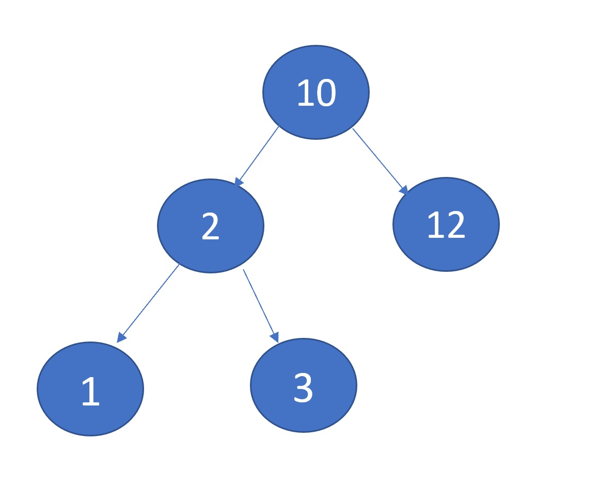
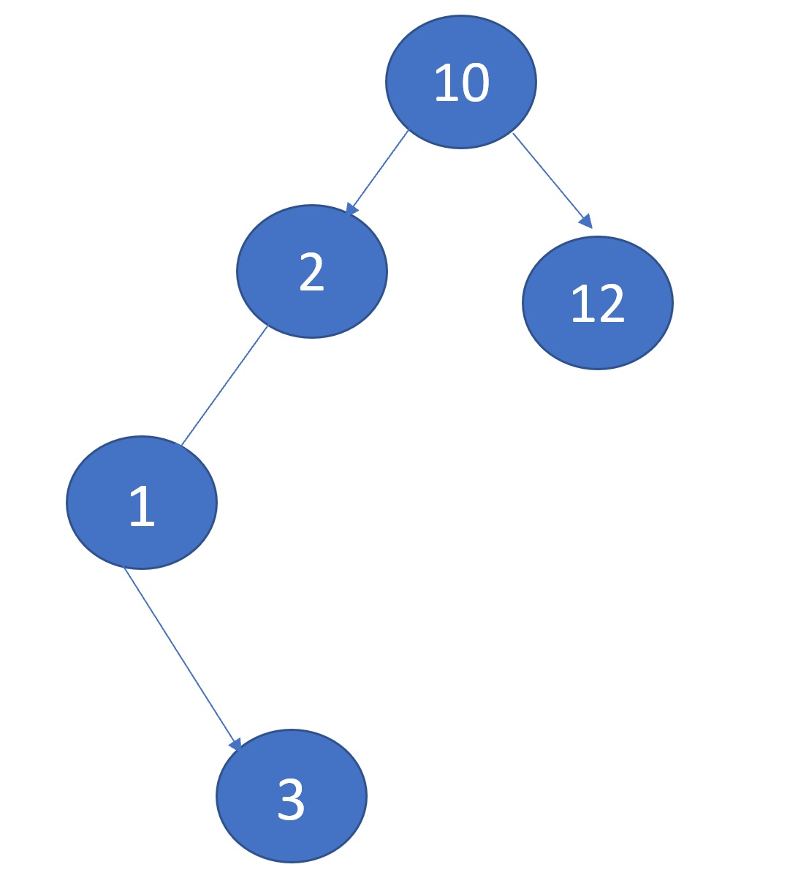
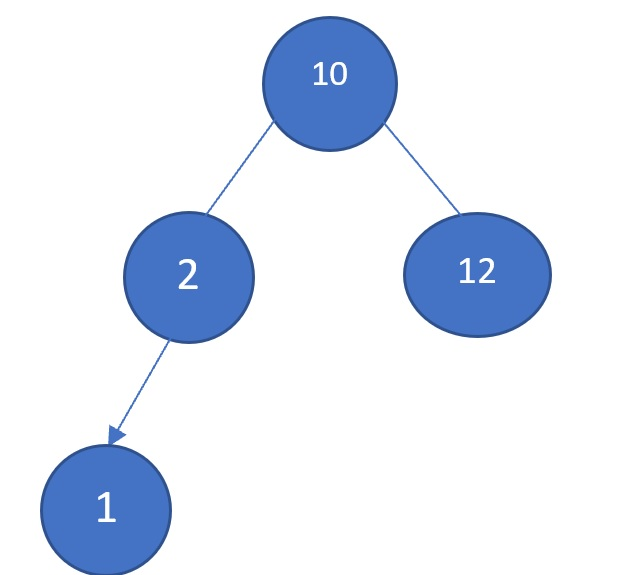
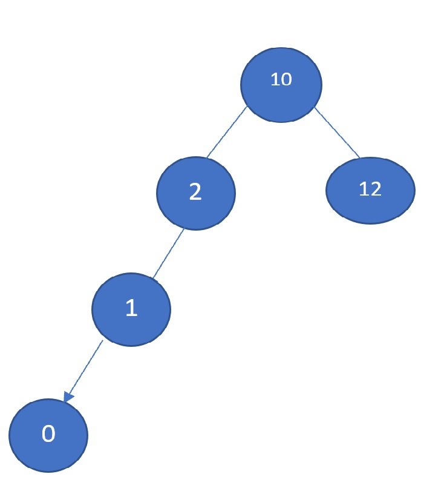
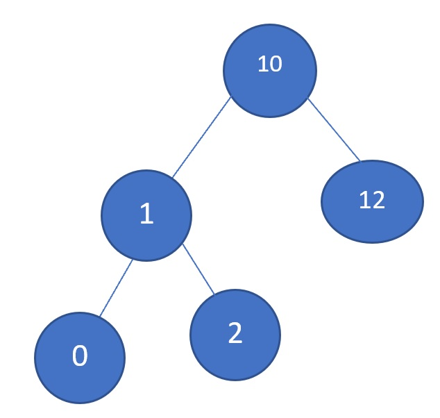

# TREES DATA STRUCTURES

In our previous lessons, we talked about how regular linked lists are very efficient with 
operations performed in both ends of the list. However, in order to find a specific node in
the list, every single node has to be iterated. This makes our lists have an O(n) efficiency
for those types of operations.

**What are they**

An improvement we can make for those types of operations are tree data structures. Trees are
technically still linked lists. You still have objects (nodes) pointing at other objects. In trees,
though, each node can be pointing at multiple objects and are typically organized in a hierarchical
manner. 

The most common type of tree data structures are binary trees. In binary trees, nodes point at only
2 nodes at a time. Below is a binary search tree, a highly efficient version of a binary tree:




**Why are the useful**

With regular linked lists, there is typically not hierarchical order. This is not a big deal when 
all we do is grabbing or adding nodes at the beggining or end of the list. However, when retrieving
specific data from anywhere in the list is required, the efficiency cost is not great. Trees allow
us to organize data hierarchically, and if they are well organized, it exponentially increases the
efficiency of retrieving specific data. 

For example, think of a book with 100 pages. Imagine this book's page number are not organized from the
lowest to the highest number. Instead, the numbers are randomly assigned in each page. So, you could open 
the book and the first page will have the number 34, then you flip to the next page and page is numbered
83, and so on. There is no organization whatsoever. Imagine that for some reason, you are trying to find
the page 25 in the book. Because each page number is randomly assigned, your only option to find that page
is iterating each single page until you find the right one. If finding this specific page takes you
10 minutes, imagine if you had a similar book but with 1000 pages instead. It will take you approximately
10 times more. 

Fortunately, basically every book has its pages numbered in order to avoid a situation like this. Now, imagine
you have a regular book with ordered page numbers. If you wanted to find the 25th page, would you still
have to iterate through each single page? Not at all. If the book has 100 pages, you will attempt to open
the book within the first quarter. If you find get the page 30, then you will look through the pages to the left
because 25 is lower than 30. This search will take you like 5 seconds. If you had a  similar book with 1000
pages, it would not take you 10 times longer to find a specific page neither. Because they are ordered, you
will repeat a similar process and would take you just slightly longer.

## BINARY TREES

Binary trees is the most common type of tree. In a binary tree, each node only connects to no more than 2 nodes. These are the elements of a binary tree:

1. Root node: You can think of this node as the head of the tree. When you perform a search, this is where
you will start. It is the element on top of the tree. 
2. Parent node: A parent node is a node that points towards a node lower in the hierarchy.
3. Child node: A the node that is being pointed by the parent node.
4. Leaf nodes: These are nodes that do not point towards any nodes lower in the hierarchy.
5. Subtrees: When you grab a node in the tree, you can think of it as the upmost node in relation of all the
nodes that are beneath it. In this sense, that node along with the nodes beneath it form a subtree.  
6. Height. Refers to how many nodes deep the tree is, starting at the root node.


[ IMAGE HERE ]

## EFFICIENCY

Binarytrees can be highly efficient, because with each iteration, you're ideally splitting the tree in halves.
This goes back to go the book example from earlier. It doesn't matter if the book is 100 pages or 1000 pages. The 
time it will take us to find an specific page will be similar as long as the page numbers are properly sorted. So,
while the efficiency of iterating a regular list is linear or O(n), the efficiency of finding a specific value in a 
balanced search tree is O(log n).

## BINARY SEARCH TREES

When properly implemented, binary tree strutures can be very efficient. One of the most common types of trees are 
**binary search trees.** Binary search trees are trees that implement sorting rules to insert data in the tree.
When data is going to be inserted in the tree, the data is compared with the data in the root node. If the data in
the new node is greater than the data in the root node, the new data is sent to the right subtree. If it's smaller,
it is sent to the left subtree. Then, the data is compared the same way with the data of the root node of that subtree
and so on, until an empty place in the tree is found. If duplicate data is inserted into the tree, it can be inserted
either at the right or the left side of the dupliate data.


**Balancing Search Trees**

Unfortunately, binary search trees aren't necessarily efficient by default. Worst case scenarios happen. Let's say that
you had 10 values added to your search tree, and each value was smaller than the previous one. Eventually, your tree would look something like this:




As you can see, it now does not look much different than a regular linked list. This means that all the benefits that
we talked about the efficiency of search trees will not apply to this case, as we will end up checking each value,
one-by-one, instead of splitting  the tree in half with each comparison. 

To avoid this worst case scenario, we need to make sure our tree is balanced. A balanced tree, refers to a tree that is 
symmetrical. In other words, it should have the same amount of subtrees on each side, and each subtree should also have
approximately the same amount of subtrees on each side.

While the example above is an unlikely scenario, it is also unlikely to expect that our tree will be balanced by default as
we keep entering data. So, you can implement special algorithms that will make sure our trees remain balanced. The 2 most 
popular methods are the **AVL algorithm** and **Red Black Trees**.

**AVL alogorithm**

The AVL algorithms ensures that one side's subtree is never more than 1 node higher than the other side's subtree counterpart.
For instance, the tree below is balanced because the left subtree is only one node deeper than the right tree.




The tree below is not balanced because it is 2 nodes deeper:




AVL trees fix this issue by detecting these unbalances and perform 1 or 2 rotations to fix this issue. In the tree above, 
the highlighted subtree became unbalance when the node colored in red was added. We can balance the tree by performing a
rotation: 




Now our tree is balanced and can keep getting benefitted from O(log n) efficiency when searching for specific data.


## BINARY SEARCH TREES OPERATIONS

Operations in binary search trees are often performed through recurssion. Which means, we'll divide a big problem in 
a smaller version of that problem, which we'll repeat until a condition known as the base case is met.

As with most data structures, some of the most common operations to perform will be **inserting**, **removing**, 
**checking if certain data exists in the tree**, **Iterating through each value**(trasversing.) In addition, we can
also check the height of the tree or one of its subtrees. 

**Inserting**

Inserting is implemented trough recursion. Performance is O(log n) because it does not have to visit every value in the
tree to find a place to be inserted. Remember every iteration splits the results in roughly half.

**Removing**

Similar to inserting. Performance is O(log n) as well. Also implemented through recursion.

**Checking if certain data exists in the tree**

Implemented through recursion as well. Performance is ideally O(log n).

**Iterating each value (trasversing)**

Since you are visiting each value, the performance will be linear. Implemented through recursion as well. 

## PROBLEMS

Since trees are implemented as linked lists in Python, the following syntax should be familiar.


```


class Binary_Trees:

    class Node:

        def __init__(self, value):

            self.value = value
            self.left = None # Remember we put the node with lower value in the left side
            self.right = None # Nodes with a higher value go to the right
    
    def __init__(self):

        self.root = None # Not having a root node would mean the tree is empty. Think of it as the head of linked lists.
    
    def insert(self, data):
        """
        This function will insert data into the tree. As you can see, it will the self._insert private function
        if the tree is not empty.
        """
        if self.root is None:
            self.root = BST.Node(data)
        else:
            self._insert(data, self.root) 


```

## Problem 1

```
# Finish the second half  of the _insert function.

    def _insert(self, value, node):
        """
        This function will look for a place to insert a node
        with 'data' inside of it.  The current sub-tree is
        represented by 'node'.  This function is intended to be
        called the first time by the insert function.
        """
        if value < node.value:
            
            if node.left is None:
               
                node.left = BST.Node(value)
            else:

                self._insert(value, node.left)

        elif value > node.value:

            # Add cour code here.

```

[See solution here](trees-solution.py)

